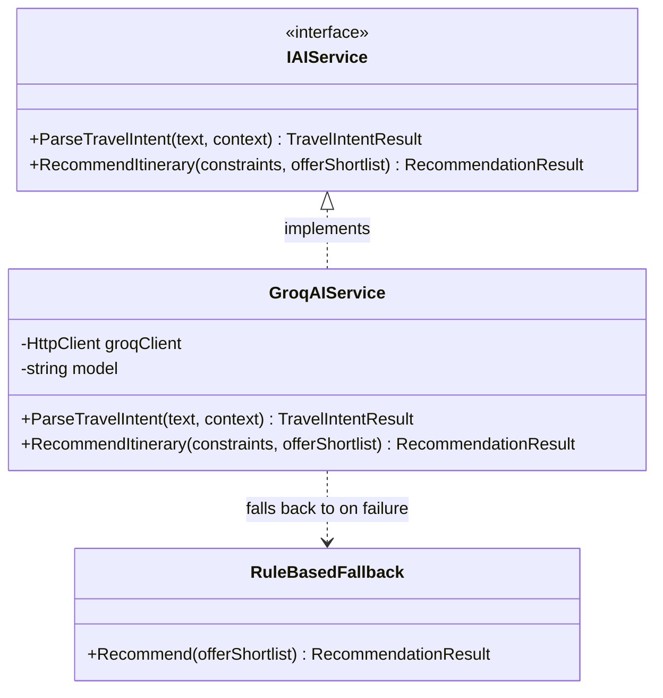
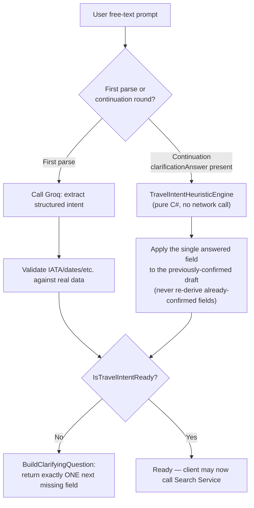
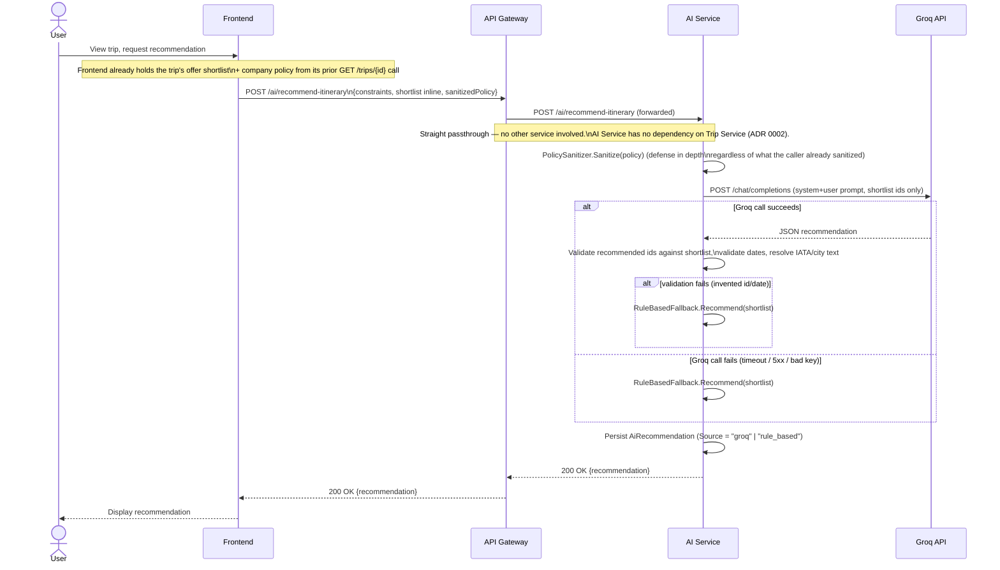

# AI Architecture

## 1. Scope — Deliberately Narrow

AI Service does exactly three things and nothing else:

1. Parse free-text natural language into a structured travel request.
2. Generate an itinerary recommendation from a **structured shortlist it is given**.
3. Rank/score those recommendations.

**AI Service never calls SerpAPI, never calls Search Service, and never calls Trip Service either.** Live flight/hotel searching is exclusively Search Service's job. AI Service's **only** outbound dependency is Groq, and its **only** caller is the Gateway, on behalf of the frontend — there is no Trip Service → AI Service call in this design at all. The offer shortlist a recommendation is ranked against is always supplied **inline in the request** by the frontend, which already has that data from its own prior calls to Trip Service/Search Service — there is no "fetch it myself if it wasn't inlined" fallback call, which would otherwise create a circular Trip Service ↔ AI Service dependency. This was corrected during architecture review, where an earlier draft mistakenly introduced both directions — see [ADR 0002](adr/0002-ai-service-no-callback-to-trip-service.md). There is no SerpAPI client and no Trip Service client anywhere in AI Service's dependency graph — enforced structurally (no such package references exist in the project) as well as by an architecture test.

## 2. Single Provider — No Switching

- **One interface (`IAIService`), one production implementation (`GroqAIService`)**. No provider factory, no provider manager, no `AI_PROVIDER` configuration key, no Gemini implementation, no `'gemini' | 'groq'` union anywhere in the codebase. The interface exists only so tests can substitute a fake (`FakeAIService` in the test project) — not as scaffolding for a runtime switch.
- **`GroqAIService`** calls Groq's OpenAI-compatible chat-completions endpoint with `response_format: json_object`, the model pinned via configuration (default `llama-3.3-70b-versatile`), `temperature` and `max_tokens` bounded via configuration (`AI:Temperature`, `AI:MaxOutputTokens` — same defaults as the original system: 0.2 and 1024).
- **`RuleBasedFallback`** (ported from `rule-based-ranker.ts`) is invoked whenever the Groq call throws — timeout, malformed JSON, non-2xx response, missing/invalid API key — so trip planning never breaks on an AI outage. This is the one piece of "multiple code paths" in the AI design that's intentionally kept: it's a resilience mechanism, not a provider-switching mechanism, and it has no external dependency of its own (pure deterministic cheapest-flight/cheapest-hotel selection).

## 3. Output Validation — Every LLM Response is Untrusted Input

Ported faithfully from `ai.service.ts`'s `parseAndValidate`:

- **Offer ids**: a recommendation referencing a `flightOfferId`/`hotelOfferId` not present in the shortlist that was actually sent to the model is rejected outright (`400`-equivalent) — never persisted, never returned to the client. The model cannot invent an id.
- **Dates**: re-parsed and calendar-validated (rejects e.g. a model-invented February 30th) via strict ISO-8601 parsing plus a round-trip check.
- **IATA/city codes**: never trusted as free text. Every code/city string the model returns is re-resolved against the bundled airport dataset (`AirportResolver`, ported from `city-airports.ts`, reading the same `airports.json` via a proper embedded-resource path rather than the original's fragile multi-path file-existence guessing). An unresolvable code is treated as null, not trusted.
- **Company policy data**: before any company `PolicyJson` is included in a prompt, it's passed through `PolicySanitizer` (ported from `sanitizePolicy()`), which strips any top-level key whose name contains `password`, `token`, `secret`, or `apikey` — no secret-shaped data ever reaches an external LLM API.

## 4. NL Travel-Intent Parsing — "Confirm One Field at a Time"

This is a hard invariant carried over unchanged: **a multi-turn clarification round never re-invokes Groq.**

- `TravelIntentHeuristicEngine` (ported from `parse-travel-intent.ts`) is a pure, local, regex/rule-based extractor for dates, routes, trip type, and stay length — used both as the LLM-mode's fallback and as the *entire* engine for continuation rounds.
- `IsTravelIntentReady(intent, bookingMode)` is the single source of truth for "can the client now call Search Service" — ported rule-for-rule: HOTELS mode needs destination + check-in + (check-out or valid night count); FLIGHTS/BOTH mode needs origin + destination + departure date + trip type (+ return date for round-trip, + night count for one-way-with-hotel).
- `BuildClarifyingQuestion` always asks about exactly one missing field, in a fixed priority order, never two at once.
- **The client never calls Search Service until `IsTravelIntentReady` is true** — this invariant is enforced by the frontend's flow but is also defense-in-depth-checked: Search Service doesn't depend on this at all (it will happily search whatever it's given), so the actual guarantee lives in the frontend UX and in AI Service returning a clarifying question instead of "ready" until the draft is genuinely complete.

## 5. AI Recommendation Flow (Sequence Diagram)

## 6. Rate Limiting

Redis-backed distributed rate limiter at the Gateway (default 10 requests/minute/user, same default as the original system), replacing the original's in-memory `SlidingWindowRateLimiter` which was per-process and would not correctly enforce a limit once AI Service runs multiple replicas. See [Authentication.md](Authentication.md) §6 for the specific library/implementation note (ASP.NET Core's built-in limiter has no first-party Redis backend) — one shared distributed-limiter mechanism is reused across auth, AI, and Search endpoints, not three separate implementations.

## 7. What Changed vs. the Original System

| Original | New | Why |
|---|---|---|
| `AiProvider` interface, two implementations (Groq, Gemini), `AI_PROVIDER` env-driven DI factory | `IAIService` interface, one implementation (`GroqAIService`), no factory | Your explicit instruction: one provider, no switching infrastructure, interface only for testability. |
| `AiService` reads persisted offer snapshots via an in-process Prisma call (same monolith), called directly by the client | AI Service **never fetches offers itself** — the frontend (via the Gateway) always inlines the shortlist in the request; Trip Service has no AI Service client at all | Removes a circular Trip Service ↔ AI Service dependency an early review draft introduced by mistake, and matches the original system's actual call pattern (the client calls AI directly) more faithfully than that draft did — see [ADR 0002](adr/0002-ai-service-no-callback-to-trip-service.md). |
| Implicit assumption AI Service could theoretically also touch SerpAPI (same process) | Structurally impossible — no SerpAPI client dependency exists in AI Service at all | Your explicit instruction: AI Service must never search directly. |
| In-memory per-process rate limiter | Redis-backed, Gateway-enforced | Correct behavior once AI Service runs more than one replica. |
| Fragile 4-path `airports.json` loader | Embedded resource with a fixed, config-driven path | Removes a build-layout-dependent failure mode. |

Everything else — the rule-based fallback, the id/date/IATA validation rules, the policy-sanitization rule, the one-field-at-a-time clarification design — is a faithful, deliberate port, not a redesign.
