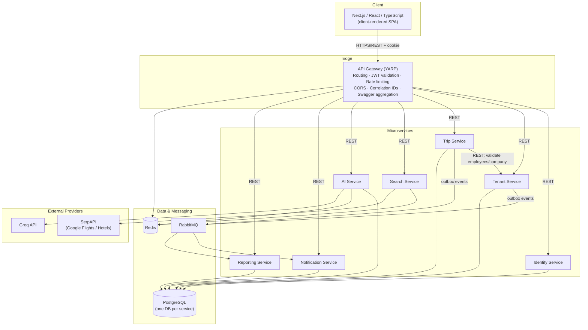
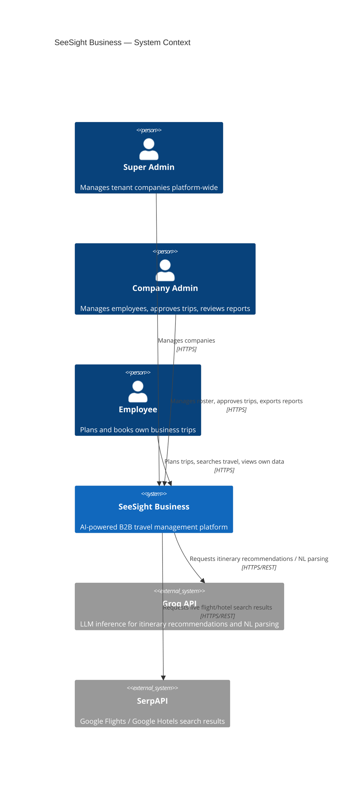

# Architecture

## 1. Overview

SeeSight Business is a B2B SaaS platform for company travel management: companies (tenants) manage employees, plan trips, search real flights/hotels, receive AI itinerary recommendations, route trips through an approval workflow, and generate spend reports and invoices.

This document describes the target architecture for the .NET 9 re-architecture of the system, replacing the original NestJS/Prisma monolith (preserved for reference as the business-logic specification, not the architectural template — see the repository's `CLAUDE.md` in the original `SeeSight` project for that system's conventions).

**Design principles**, in priority order for every decision in this document and its siblings:

1. **Maintainability** over cleverness — a service should be understandable by reading its own code, without needing the whole system in your head.
2. **Scalability** where the domain actually needs it (Trip/Search/AI are read-and-write-heavy; Reporting is read-heavy and event-driven) — not applied uniformly for its own sake.
3. **Security** — tenant isolation, least-privilege service boundaries, no secrets in logs/prompts/notifications, fail-fast on misconfiguration.
4. **Clean architecture**, sized to each service's actual complexity (see [Microservices.md](Microservices.md) §Clean Architecture per Service) — a thin service does not get the same layering as a rich domain service.

## 2. Technology Stack

| Layer | Technology |
|---|---|
| Backend runtime | .NET 9 / ASP.NET Core |
| ORM | Entity Framework Core (Npgsql provider) |
| Database | PostgreSQL — one logical database per service |
| API Gateway | YARP (Yet Another Reverse Proxy) |
| Sync inter-service communication | REST/JSON over HTTPS (see [Microservices.md](Microservices.md) §Communication) |
| Async inter-service communication | RabbitMQ, transactional outbox pattern |
| Caching / distributed rate limiting | Redis |
| Application patterns | MediatR (CQRS-lite), FluentValidation, Clean Architecture or Vertical Slice Architecture depending on service complexity |
| Observability | OpenTelemetry, Serilog, Prometheus, Grafana, Jaeger |
| AI provider | Groq (single provider — see [AIArchitecture.md](AIArchitecture.md)) |
| External search provider | SerpAPI (Google Flights / Google Hotels) |
| Frontend | Next.js, React, TypeScript (same stack as before, redesigned implementation — see [APIContracts.md](APIContracts.md) for the contract it targets) |
| Local orchestration | Docker Compose |
| Production hosting | Railway (multi-service, from one monorepo) |

## 3. High-Level System Architecture

Key properties visible in this diagram, each detailed in its own document:

- The Gateway is the **only** component the frontend talks to — no service is directly internet-facing.
- **AI Service has exactly one outbound dependency: Groq.** It never calls Search Service, SerpAPI, or Trip Service — and no other service calls into it except the Gateway, on behalf of the frontend. The offer shortlist a recommendation is ranked against is always supplied inline by the frontend, which already has that data from its own prior calls. See [AIArchitecture.md](AIArchitecture.md) and [ADR 0002](adr/0002-ai-service-no-callback-to-trip-service.md).
- **Search Service never writes to Postgres** — it is a stateless, cached proxy over SerpAPI. Persistence of a selected offer happens only inside Trip Service.
- Notification Service and Reporting Service **never receive synchronous calls from any other service** — they react to RabbitMQ events only, published via each writer's own transactional outbox. Reporting Service also owns the Dashboard (not Trip Service, and not a Gateway-level aggregation) — see [ADR 0001](adr/0001-no-gateway-aggregation-dashboard-in-reporting.md) and [Microservices.md](Microservices.md) §RabbitMQ Event Flow.
- Every arrow into a PostgreSQL cylinder is **owned exclusively** by that one service — no service reads another's database directly. See [DatabaseDesign.md](DatabaseDesign.md).
- The **only** synchronous service-to-service REST edge in the whole system is Trip Service → Tenant Service (employee/company validation). AI Service is reached directly by the Gateway on the frontend's behalf, not through Trip Service. The Gateway itself performs no business-data composition of any kind.

## 4. C4 Context Diagram

## 5. Repository Layout

The complete, project-by-project directory tree — every `.csproj`, test project, and its allowed references — is documented in **[SolutionStructure.md](SolutionStructure.md)** (with reference rules detailed further in **[ProjectReferenceDiagram.md](ProjectReferenceDiagram.md)**). At a glance: `src/Gateway`, `src/Services/<Identity|Tenant|Trip|Search|AI|Notification|Reporting>`, `src/Shared/*`, `tests/` (mirroring `src/`), `docker/`, `.github/workflows/`, `frontend/` (Next.js, see [Frontend.md](Frontend.md)), and `docs/` (this documentation set, including `docs/adr/`).

## 6. Cross-Cutting Documents

| Concern | Document |
|---|---|
| Service boundaries, communication, per-service internal architecture | [Microservices.md](Microservices.md) |
| Data model, per-service schema, ER diagrams | [DatabaseDesign.md](DatabaseDesign.md) |
| Login, tokens, session lifecycle | [Authentication.md](Authentication.md) |
| Roles, claims, policy enforcement | [Authorization.md](Authorization.md) |
| Tenant isolation model | [TenantArchitecture.md](TenantArchitecture.md) |
| AI Service design | [AIArchitecture.md](AIArchitecture.md) |
| Docker/Railway topology, CI/CD | [Deployment.md](Deployment.md) |
| Full REST endpoint catalog | [APIContracts.md](APIContracts.md) |
| Tracing/metrics/logging | [Observability.md](Observability.md) |
| Frontend (Next.js) architecture | [Frontend.md](Frontend.md) |
| Milestone plan | [DevelopmentRoadmap.md](DevelopmentRoadmap.md) |
| Coding conventions, ADR process | [CodingStandards.md](CodingStandards.md) |
| Architecture decision records | [adr/](adr/) |
| Per-service dependency/runtime profile (one consolidated table) | [ServiceDependencyMatrix.md](ServiceDependencyMatrix.md) |
| Complete .NET project-by-project directory tree | [SolutionStructure.md](SolutionStructure.md) |
| Project reference rules, allowed/forbidden, no-circular-reference argument | [ProjectReferenceDiagram.md](ProjectReferenceDiagram.md) |
| Fine-grained implementation milestones (M0–M15) | [ImplementationRoadmap.md](ImplementationRoadmap.md) |
| Pre-Phase-3 critical architecture review + final readiness recommendation | [ArchitectureValidation.md](ArchitectureValidation.md) |

## 7. What This Replaces

The original system (`SeeSight`, NestJS monolith) remains the **business-rule specification** for this rewrite — every documented behavior in its `docs/*.md` (trip state machine, tenant isolation rules, AI validation rules, report/dashboard spend definitions, etc.) is preserved here unless explicitly called out as an intentional change. The most significant intentional changes, and why, are summarized at the end of each relevant document; the full list is in the approved architecture plan that this documentation set implements.
