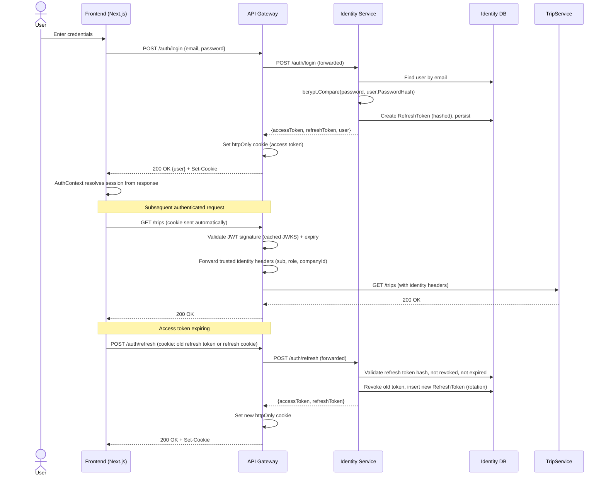
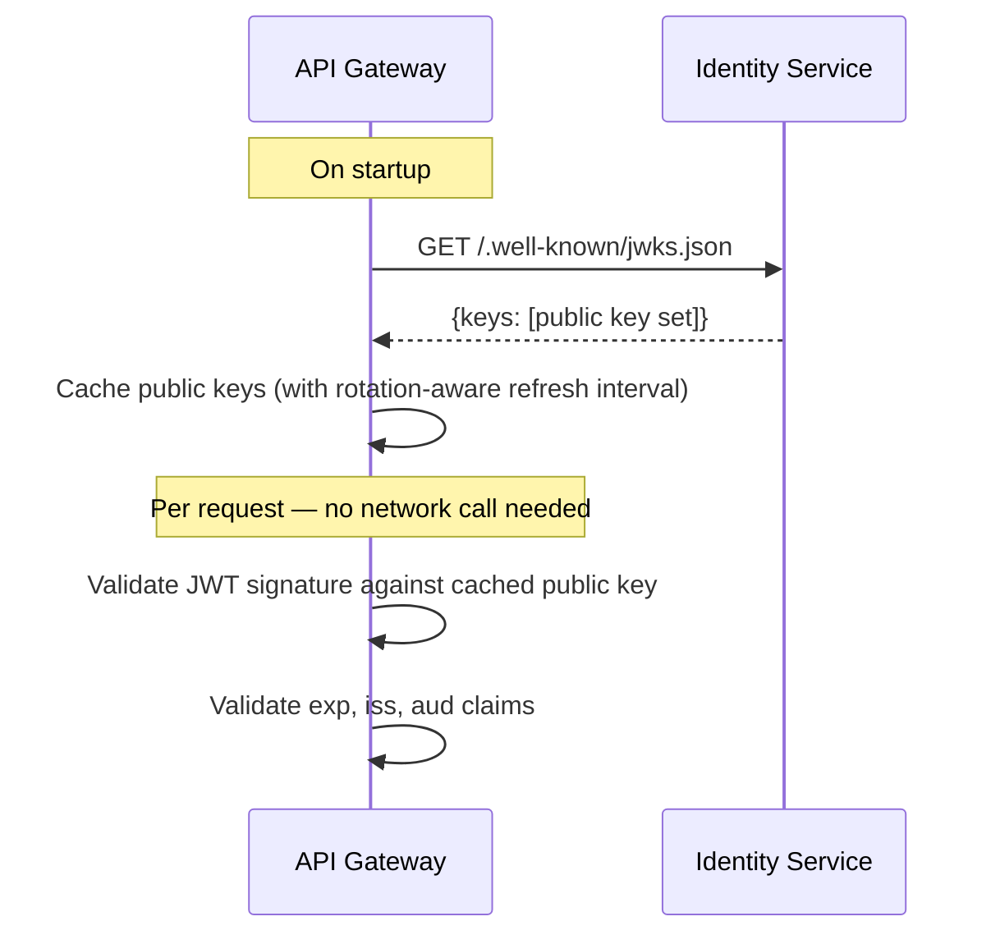

# Authentication

## 1. Overview

Identity Service is the **sole token issuer** in the system. Every other service — including the API Gateway — only ever *validates* tokens; none of them can issue or refresh one. This keeps authentication logic in exactly one place, matching the original system's single-`auth`-module design, while fixing three gaps the original had: no refresh tokens, no server-side logout/revocation, and a JWT signing secret that silently defaulted to a hardcoded dev value if unset.

## 2. Tokens

| Token | Lifetime | Storage | Purpose |
|---|---|---|---|
| **Access token** | 15 minutes | Not persisted server-side (stateless JWT) | Sent on every API call; validated by signature + expiry only. |
| **Refresh token** | 30 days | Persisted **hashed** in Identity Service's `RefreshToken` table | Exchanged for a new access+refresh token pair; rotated (old token revoked) on every use. |

- **Signing**: RS256 (asymmetric). Identity Service holds the private key (from a required startup secret — see §5). Every validator (the Gateway) checks signatures against Identity Service's public key, exposed at a JWKS endpoint (`GET /.well-known/jwks.json`) and cached after first fetch — so token validation never requires a live call to Identity Service on the request hot path.
- **Claims**: `sub` (user id), `email`, `role` (`SUPER_ADMIN`/`COMPANY_ADMIN`/`EMPLOYEE`), `companyId` (nullable — unassigned company admins and super admins have none), `jti` (unique token id, recorded for potential future revocation-by-jti if ever needed).
- **Refresh token rotation**: each `POST /auth/refresh` call issues a brand-new access+refresh pair and immediately revokes the presented refresh token (`RevokedAt` set, `ReplacedByTokenId` links to the new one) — a stolen-and-reused-later refresh token is detected the moment the legitimate client tries to use its own (now-revoked) copy, at which point the whole chain can be revoked as a compromise signal.
- **Logout is a real server-side action now**: `POST /auth/logout` revokes the current refresh token (not just "clear the cookie" as in the original system, where a copied bearer token stayed valid until natural expiry).

## 3. Cookie + Bearer (both, always)

Identical policy to the original system: the access token is delivered **both** as an httpOnly cookie (`SameSite=Lax`, `Secure` in production, `Path=/`) **and** available via `Authorization: Bearer` — set/read exclusively at the API Gateway. Downstream services never see the cookie; the Gateway validates it once and forwards trusted identity headers internally (see [Authorization.md](Authorization.md) §Claim Propagation).

The redesigned frontend (see the frontend section of the approved architecture) relies on the httpOnly cookie as its primary transport and no longer stores the access token in `localStorage`; Bearer-header auth remains available for Swagger and non-browser API clients.

## 4. Password Handling

- **Hashing**: BCrypt (`BCrypt.Net-Next`), 12 rounds — same algorithm and work factor as the original system, a deliberate compatibility choice so migrated user rows keep working without a forced mass password reset.
- **Register**: creates a `COMPANY_ADMIN` user with `companyId = null` (self-signup story unchanged — a company is created/assigned afterward). Duplicate email → `409 Conflict`.
- **Login**: case-insensitive/trimmed email lookup, generic `401 Unauthorized "Invalid email or password"` on either a missing user, an inactive user, or a wrong password — never reveals which (no user-enumeration).
- **Forgot password**: generates a random token, stores only its SHA-256 hash, 1-hour expiry, always returns a generic success response regardless of whether the email exists; in `Development` environment only, the raw token/URL is also returned in the response body for local testing (never in `Staging`/`Production`).
- **Reset password**: validates hash + expiry + not-already-used, updates the password hash and clears `MustChangePassword`, inside one DB transaction with marking the token used.
- **Change password** (authenticated): requires current password match, rejects new === current, clears `MustChangePassword` — the only path that lifts the forced-change flag for employees provisioned with a temporary password.
- **`MustChangePassword` gate**: preserved from the original system — a request from a user with `MustChangePassword = true` is rejected (`403`) for every endpoint except `POST /auth/change-password`, `GET /auth/me`, `POST /auth/logout`, `POST /auth/refresh`. Enforced as an ASP.NET Core middleware/authorization requirement at the Gateway.

## 5. Configuration & Fail-Fast

- `Identity:Jwt:SigningKey` (or equivalent secret-manager entry) is a **required** startup configuration value, validated via `IOptions<JwtOptions>` + `ValidateOnStart()`. In any environment other than `Development`, a missing signing key **fails the container's startup** — no silent fallback to a hardcoded default, closing the gap in the original system's `configuration.ts` (`JWT_SECRET` defaulted to `'dev-only-change-me-seesight-jwt'` if unset).
- `Identity:Jwt:AccessTokenLifetime` (default 15m), `Identity:Jwt:RefreshTokenLifetime` (default 30d) are configurable but have sane non-null defaults appropriate for `Development` only; `Production` values are pinned in deployment configuration, not left to a code default.

## 6. Rate Limiting

`POST /auth/login` and `POST /auth/register` are rate-limited at the API Gateway, correctly enforced across multiple Gateway replicas — closing a gap the original system had (no rate limiting existed on auth endpoints at all). **Fails open** on a Redis outage — a request is allowed through (not blocked) if the limiter can't reach Redis, logged and metered rather than silently ignored — per [ADR 0007](adr/0007-redis-dependent-features-fail-open.md); a Redis blip degrades brute-force protection briefly rather than blocking every login attempt. **Implementation note**: ASP.NET Core's built-in `Microsoft.AspNetCore.RateLimiting` middleware ships partitioned in-memory limiters only — there's no first-party distributed/Redis-backed store as of .NET 9. A distributed limiter needs either a community package (e.g. `RedisRateLimiting`) or a small custom `RateLimiter` implementation backed by a Redis Lua-script sliding window; this is a Phase 3/5 implementation decision, recorded as an ADR once chosen (§ [CodingStandards.md](CodingStandards.md) §7). The same gap/decision applies to the AI Service and Search Service rate limiters described in [AIArchitecture.md](AIArchitecture.md) §6 and [Microservices.md](Microservices.md) — one distributed rate-limiting mechanism, reused for all three call sites, not three separate implementations.

## 7. Authentication Flow (Sequence Diagram)

## 8. JWKS Validation Flow

## 9. What Changed vs. the Original System

| Original | New | Why |
|---|---|---|
| Single 24h access token, no refresh | 15-minute access token + rotating 30-day refresh token | Shorter blast radius if an access token leaks; refresh rotation detects reuse of a stolen refresh token. |
| Logout = clear cookie only (stateless JWT, no revocation) | Logout revokes the refresh token server-side | A copied bearer token now still expires quickly (15 min) rather than staying valid for up to 24h post-"logout". |
| `JWT_SECRET` silently defaults to a dev string if unset | Required secret, fails startup if missing outside `Development` | Prevents ever accidentally running production on a known/guessable signing key. |
| No rate limiting on login/register | Redis-backed rate limiting at the Gateway | Basic brute-force protection that didn't exist before. |
| Shared HMAC secret needed by every process that validates a token | RS256 + JWKS — only Identity Service holds the private key | Standard microservices pattern; no secret sharing required between services for token validation. |
