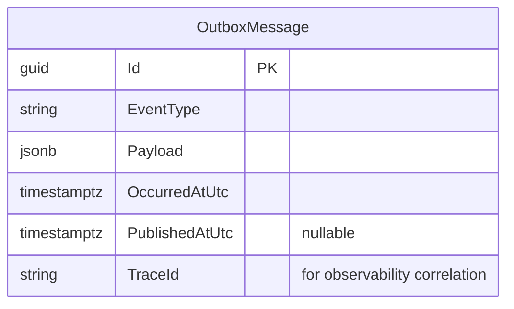
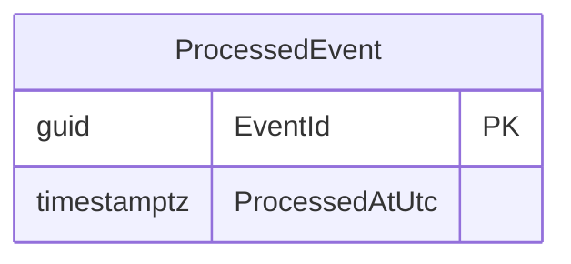
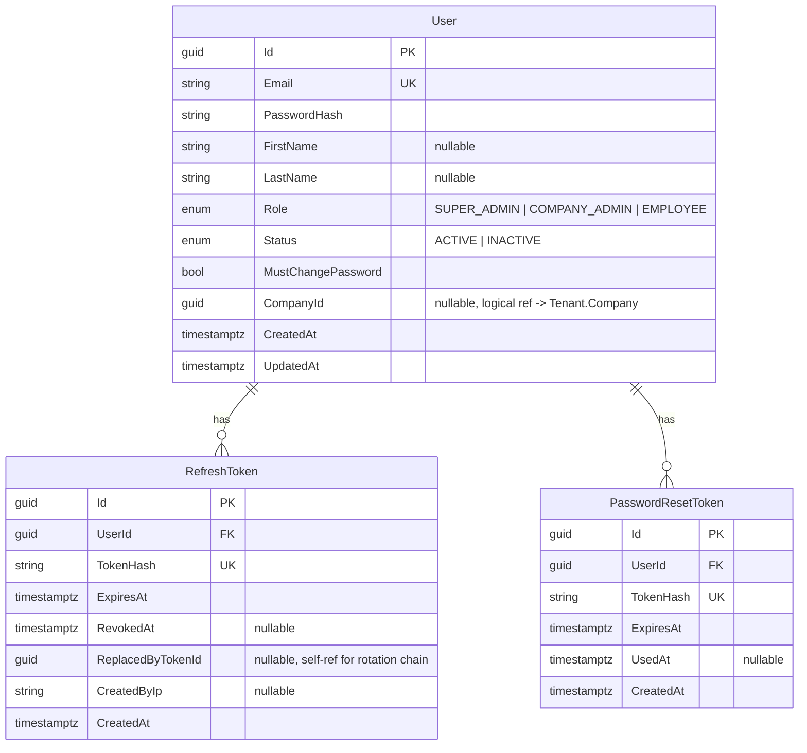
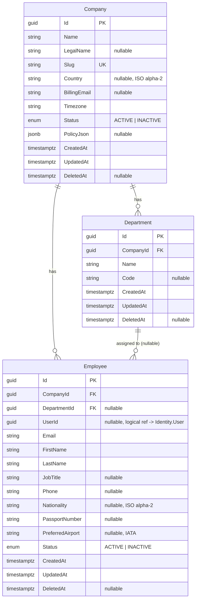
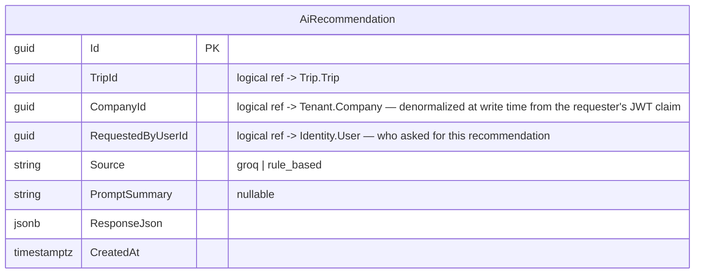
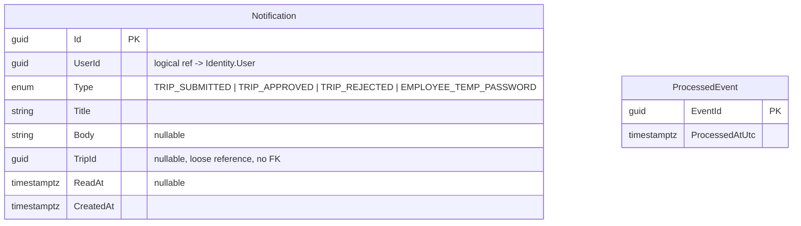
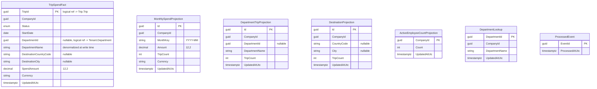

# Database Design

## 1. Strategy

- **Database-per-service.** Every service in [Microservices.md](Microservices.md) that has state owns exactly one PostgreSQL database, accessed only through its own EF Core `DbContext`. No service ever connects to another service's database.
- **No cross-service foreign keys.** A reference to an entity owned by another service (e.g. `Trip.CompanyId`, `TripTraveler.EmployeeId`, `Notification.UserId`) is a plain `Guid` column with no DB-level FK constraint. Referential validity is enforced at write time via a synchronous REST call to the owning service (see [Microservices.md](Microservices.md) §Communication), not by the database afterward. These columns are marked `// logical reference — owned by <Service>` in each `DbContext` for discoverability.
- **All primary keys are `Guid` (v7 where the driver/EF Core version supports it, for index-friendly time-ordering)**, matching the original system's `cuid`-style identifiers conceptually (opaque, non-guessable, safe to generate client-side or service-side without a round-trip).
- **Soft delete** (`DeletedAt DateTimeOffset?`) is used only where the original system used it: `Company`, `Department`, `Employee`, `Trip`. Enforced automatically via an EF Core global query filter (`modelBuilder.Entity<T>().HasQueryFilter(e => e.DeletedAt == null)`) in every `DbContext` that owns such an entity — not a manual `.Where()` repeated at every call site.
- **Tenant scoping** (`CompanyId`) is enforced the same way: a global query filter scoped to the current request's tenant context (see [TenantArchitecture.md](TenantArchitecture.md)), with an explicit bypass for `SUPER_ADMIN`.
- **Immutable/append-only tables** — `ApprovalAction`, `FlightOfferSnapshot`, `HotelOfferSnapshot`, `AiRecommendation`, `Invoice`, `InvoiceLineItem` — have no `UpdatedAt` column and no update path in the Application layer; only `Create`. This is enforced by convention (no `Update`/`Set` method exposed on these entities) plus a code-review/architecture-test check that no `DbSet<T>.Update(...)` call exists for them.
- **Money** is `decimal(12,2)` in Postgres (`numeric(12,2)`), never `double`/`float`. All rounding goes through `SeeSight.Shared.Common`'s `MoneyRounding.Round(decimal value)` helper — the single successor to the original system's three duplicated copies of `roundMoney`.
- **Dates** that represent calendar days (`Trip.StartDate`, `Trip.EndDate`, `HotelOfferSnapshot.CheckIn/CheckOut`) are stored as `date` (`DateOnly` in EF Core 9), not `timestamp`, avoiding the timezone-drift class of bug entirely rather than normalizing it defensively at every comparison.
- **Migrations**: `dotnet ef migrations add <Name>` per service, applied via `dotnet ef database update` in dev and a `migrate`-only step in the deploy pipeline (mirrors the original system's `prisma migrate deploy` convention — migrations never run implicitly inside application startup code in production). Never edit an applied migration — additive only.

## 2. Transactional Outbox

Trip Service and Tenant Service (the two publishers of domain events, per [Microservices.md](Microservices.md) §RabbitMQ Event Flow) each have an `OutboxMessage` table:



Written in the same `SaveChanges()` transaction as the domain state change it describes; delivery to RabbitMQ is handled by **MassTransit's EF Core outbox integration** rather than a hand-rolled polling relay — see [ADR 0003](adr/0003-adopt-masstransit-for-messaging.md). The column shape above documents the *intent* (durable, transactional, at-least-once delivery); the exact table follows MassTransit's own outbox entity conventions at implementation time. Tenant Service's outbox also carries the `EmployeeCreated`/`EmployeeActivated`/`EmployeeDeactivated` events Reporting Service needs for its Dashboard projection (§8) — not just the employee-login-provisioning event originally scoped.

Notification Service and Reporting Service (the two consumers) each have a `ProcessedEvent` table for idempotent consumption (RabbitMQ delivery is at-least-once, so a redelivered event must not create a duplicate notification or double-count a projection):



## 3. Identity Service Database



`User` has no `DeletedAt` — users are deactivated via `Status`, never soft-deleted, matching the original system exactly (tombstoning on employee deletion is a Tenant Service concern, not Identity's — see below).

## 4. Tenant Service Database



Constraints: `@Unique(Department.CompanyId, Department.Name)`, `@Unique(Employee.CompanyId, Employee.Email)` (same email may exist under different tenants — tenant-scoped uniqueness only, exactly as today). `Employee.UserId` is a logical reference to Identity Service's `User` — Tenant Service never queries Identity's database directly; when it needs to provision a login it calls Identity Service's REST API to create the `User` and stores the returned id.

## 5. Trip Service Database

```mermaid
erDiagram
    Trip ||--o{ TripTraveler : has
    Trip ||--|| Approval : has
    Approval ||--o{ ApprovalAction : has
    Trip ||--o{ FlightOfferSnapshot : has
    Trip ||--o{ HotelOfferSnapshot : has
    Trip ||--o| Invoice : has
    Invoice ||--o{ InvoiceLineItem : has

    Trip {
        guid Id PK
        guid CompanyId "logical ref -> Tenant.Company"
        guid CreatedByUserId "logical ref -> Identity.User"
        string Purpose
        string DestinationCountry "nullable, ISO alpha-2"
        string DestinationCity "nullable"
        date StartDate
        date EndDate
        decimal BudgetAmount "nullable, 12,2"
        string BudgetCurrency
        string Notes "nullable"
        enum BookingMode "FLIGHTS | HOTELS | BOTH"
        enum Status "DRAFT | PENDING_APPROVAL | APPROVED | REJECTED | IN_PROGRESS | COMPLETED | CANCELLED"
        timestamptz CreatedAt
        timestamptz UpdatedAt
        timestamptz DeletedAt "nullable"
    }

    TripTraveler {
        guid Id PK
        guid TripId FK
        guid EmployeeId "logical ref -> Tenant.Employee"
        bool IsPrimary
        timestamptz CreatedAt
    }

    Approval {
        guid Id PK
        guid TripId FK UK
        enum Status "PENDING | APPROVED | REJECTED"
        timestamptz DecidedAt "nullable"
        timestamptz CreatedAt
        timestamptz UpdatedAt
    }

    ApprovalAction {
        guid Id PK
        guid ApprovalId FK
        guid ActorUserId "logical ref -> Identity.User"
        enum Action "SUBMIT | APPROVE | REJECT | COMMENT"
        string Comment "nullable"
        timestamptz CreatedAt
    }

    FlightOfferSnapshot {
        guid Id PK
        guid TripId FK
        enum Provider "SERPAPI | MANUAL | OTHER"
        string ProviderOfferId "nullable"
        string Origin "nullable"
        string Destination "nullable"
        timestamptz DepartAt "nullable"
        timestamptz ReturnAt "nullable"
        enum TravelClass "nullable"
        decimal PriceAmount "nullable, 12,2"
        string Currency "nullable"
        jsonb RawPayload
        bool Selected
        timestamptz CreatedAt
    }

    HotelOfferSnapshot {
        guid Id PK
        guid TripId FK
        enum Provider "SERPAPI | MANUAL | OTHER"
        string ProviderOfferId "nullable"
        string HotelName "nullable"
        string City "nullable"
        date CheckIn "nullable"
        date CheckOut "nullable"
        decimal PriceAmount "nullable, 12,2"
        string Currency "nullable"
        jsonb RawPayload
        bool Selected
        timestamptz CreatedAt
    }

    Invoice {
        guid Id PK
        guid TripId FK UK "one invoice per trip"
        string InvoiceNumber UK
        timestamptz IssuedAt
        string BillToNameSnapshot
        string BillToCountrySnapshot "nullable"
        decimal TotalAmount "12,2"
        string Currency
        timestamptz CreatedAt
    }

    InvoiceLineItem {
        guid Id PK
        guid InvoiceId FK
        string Description
        enum SourceType "FLIGHT | HOTEL"
        decimal Amount "12,2"
        string Currency
        timestamptz CreatedAt
    }
```

`Invoice`/`InvoiceLineItem` are populated once, at first `POST /trips/{id}/invoice`, by snapshotting the trip's selected offers and the company's current billing name (fetched via REST from Tenant Service at that moment) — never updated afterward, even if the underlying trip or company data changes later. See [Microservices.md](Microservices.md) §1 for why invoicing lives here rather than in a standalone service.

Indexes mirror the original schema's intent: `Trip(CompanyId)`, `Trip(CreatedByUserId)`, `Trip(Status)`, `Trip(StartDate, EndDate)`, `Trip(DeletedAt)`; `TripTraveler` unique on `(TripId, EmployeeId)`; offer snapshots indexed on `(TripId, Selected)`.

## 6. AI Service Database



Single table, insert-only. AI Service holds no other state — it is otherwise a stateless orchestrator over Groq (see [AIArchitecture.md](AIArchitecture.md)). `CompanyId` and `RequestedByUserId` exist solely so `GET /ai/trips/{tripId}/recommendations` can enforce access control without AI Service needing any dependency on Trip Service — see [ADR 0004](adr/0004-ai-recommendation-history-authorization-scope.md) for the narrowed (company/requester-scoped, not full trip-access-scoped) authorization rule this enables. The standard tenant-scoped EF Core query filter (`CompanyId == currentTenant.CompanyId`, bypassed for `SUPER_ADMIN` — § [TenantArchitecture.md](TenantArchitecture.md)) applies to this table exactly as it does to every other tenant-scoped entity in the system.

## 7. Notification Service Database



Indexes: `(UserId, ReadAt)`, `(UserId, CreatedAt)`, `TripId`. No `DeletedAt` — `DELETE /notifications/clear-all` is a real hard delete, matching the original system (notifications have no audit-retention requirement).

## 8. Reporting Service Database

Pure read-model — no write API beyond the event consumers. A raw per-trip fact table plus pre-aggregated projections built from it, so projections can always be deterministically rebuilt by replaying facts if a projection ever needs correcting:



`TripSpendFact` is upserted on **every** trip lifecycle event (`TripCreated`, `TripSubmitted`, `TripApproved`, `TripRejected`, `TripCancelled`, `TripCompleted`, `OfferAttached`) — not only committed-status ones — so it doubles as the source for both spend reporting *and* the Dashboard's "upcoming trips" list (`Status NOT IN (CANCELLED, COMPLETED, REJECTED) AND StartDate >= today`) and "pending approvals" count (`Status = PENDING_APPROVAL`). Only committed statuses (`APPROVED`/`IN_PROGRESS`/`COMPLETED`) ever carry a non-zero `SpendAmount`, matching the original system's `COMMITTED_TRIP_STATUSES` rule, now expressed as an event-projection rule instead of a query-time filter. `MonthlySpendProjection`/`DepartmentTripProjection`/`DestinationProjection` are maintained incrementally as facts change. `ActiveEmployeeCountProjection` is maintained from Tenant Service's `EmployeeCreated`/`EmployeeActivated`/`EmployeeDeactivated` events — this is what lets `GET /dashboard/summary` (now owned by Reporting Service — see [ADR 0001](adr/0001-no-gateway-aggregation-dashboard-in-reporting.md)) answer without a synchronous call to Tenant Service. `Reports.md`-equivalent CSV/JSON exports read directly from these tables — no 15-minute TTL cache is needed anymore since the projections are always current relative to the last processed event, not recomputed on read.

**`DepartmentLookup`** (added per [ADR 0005](adr/0005-reporting-projection-idempotency-and-department-lookup.md)) is kept current by consuming Tenant Service's `DepartmentCreated`/`DepartmentUpdated` events. `TripSpendFact` and `DepartmentTripProjection` store only `DepartmentId` — the department *name* shown in any query result is resolved via a join against `DepartmentLookup` at read time, so renaming a department immediately relabels every historical report, matching the original system's live-join behavior instead of freezing the name at the moment each trip event was processed.

**Idempotency and ordering** (per [ADR 0005](adr/0005-reporting-projection-idempotency-and-department-lookup.md)): every upsert into `TripSpendFact` compares the incoming event's `Version`/`UpdatedAtUtc` against the value already stored for that `TripId` and is a no-op if the incoming event is not newer — combined with the `ProcessedEvent` idempotency table, this makes every projection update safe under both duplicate delivery (at-least-once RabbitMQ semantics) and out-of-order delivery (no strict per-aggregate ordering guarantee from the broker).

**Multi-tenancy**: every table in this database carries `CompanyId` and is subject to the same EF Core tenant query filter (bypassed for `SUPER_ADMIN`) as Trip/Tenant Service's own tables — easy to overlook on a "read-only projection" service, so it's stated explicitly here rather than assumed.

## 9. EF Core Conventions

- Fluent configuration (`IEntityTypeConfiguration<T>` per entity, one file each) — no data-annotation attributes on domain entities, keeping the `Domain` layer free of EF Core references (a Clean Architecture requirement enforced by an architecture test — see [CodingStandards.md](CodingStandards.md)).
- `DbContext` lives in each service's `Infrastructure` layer, never referenced from `Domain` or `Application` (`Application` depends only on repository/persistence *interfaces* it defines, if any — most reads go through EF Core directly via MediatR query handlers rather than a repository abstraction, per [Microservices.md](Microservices.md) §8).
- Connection strings are `IOptions<T>`-bound and validated at startup (`ValidateOnStart()`) — a service fails to boot rather than starting misconfigured.
