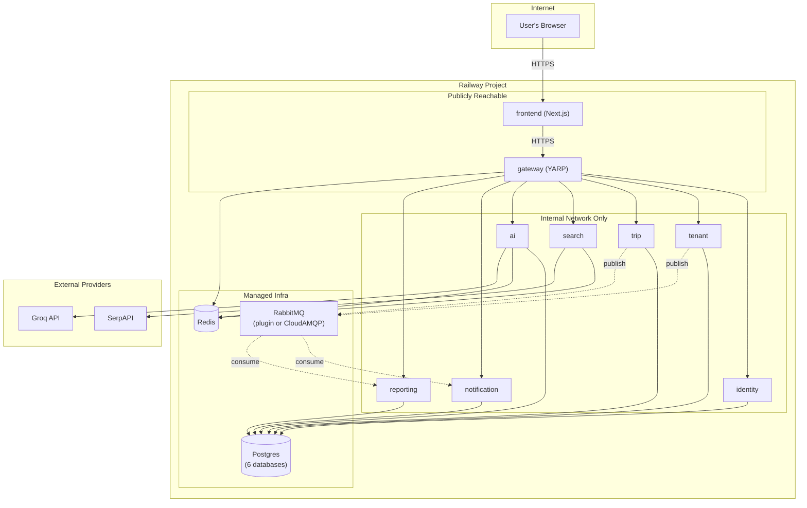
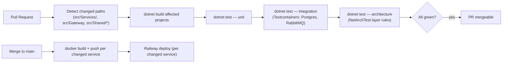

# Deployment

## 1. Local Development

One `docker-compose.yml` at `docker/docker-compose.yml`, bringing up the full stack:

| Component | Image / build | Notes |
|---|---|---|
| `postgres` | `postgres:16-alpine` | One server, multiple databases (`identity`, `tenant`, `trip`, `ai`, `notification`, `reporting`) — one per service, created via an init script. |
| `rabbitmq` | `rabbitmq:3-management-alpine` | Management UI on `15672` for local debugging of queues/exchanges. |
| `redis` | `redis:7-alpine` | Rate limiting + search cache. |
| `otel-collector` | `otel/opentelemetry-collector-contrib` | Receives OTLP from every service, fans out to Jaeger + Prometheus. |
| `jaeger` | `jaegertracing/all-in-one` | Trace viewer. |
| `prometheus` | `prom/prometheus` | Metrics storage, scrapes the collector. |
| `grafana` | `grafana/grafana` | Dashboards over Prometheus + Jaeger. |
| `gateway` | build: `src/Gateway/Dockerfile` | Public entry point, port `8080`. |
| `identity` \| `tenant` \| `trip` \| `search` \| `ai` \| `notification` \| `reporting` | build: `src/Services/<Service>/Dockerfile` | Internal-only, not published to the host in the default compose file (reachable via the Docker network, through the Gateway). |
| `frontend` | build: `frontend/Dockerfile` | Next.js dev/production build, port `3000`, targets the Gateway. |

An `docker-compose.infra.yml` variant brings up only Postgres/RabbitMQ/Redis/observability — used when developing a single service natively against containerized infrastructure (the common inner-loop case), mirroring the original system's `docker compose up postgres -d` pattern.

Every service Dockerfile follows the same 3-stage pattern (`build` → `publish` → `runtime`, `mcr.microsoft.com/dotnet/sdk:9.0` → `mcr.microsoft.com/dotnet/aspnet:9.0`), consolidated — the original system had two near-duplicate API Dockerfiles; this system has exactly one Dockerfile per service, no duplicates.

## 2. Production — Railway

Stays on Railway, extending the original system's proven 2-service (api + web) setup to the full service count. Each service is its own Railway service within the same project, root-directory-scoped to its `src/Services/<Service>` folder, with its own `railway.toml`:

```toml
[build]
builder = "DOCKERFILE"
dockerfilePath = "Dockerfile"

[deploy]
startCommand = "dotnet <Service>.dll"
preDeployCommand = ["dotnet ef database update"]
healthcheckPath = "/health/ready"
healthcheckTimeout = 300
restartPolicyType = "ON_FAILURE"
restartPolicyMaxRetries = 10
```

| Concern | Railway resource |
|---|---|
| Postgres (×6 logical databases) | Railway managed Postgres plugin(s) — one Postgres instance hosting multiple databases, or one plugin per service, decided at Phase 3 based on cost |
| RabbitMQ | Railway plugin if available at implementation time, otherwise an external managed provider (e.g. CloudAMQP) |
| Redis | Railway managed Redis plugin |
| Each of the 8 backend services + Gateway | One Railway service each, deployed from this monorepo |
| Frontend | One Railway service (Next.js), `NEXT_PUBLIC_API_URL` pointed at the Gateway's public URL, baked in at build time exactly as in the original system |

**Operational reality check**: this is a real step up in running cost from the original system's 2-service setup — 9 always-on compute services plus managed Postgres/RabbitMQ/Redis will not fit comfortably in a free/hobby tier the way the original 2-service deployment did. Two ways to manage this, decided at Phase 13 based on actual budget: (a) consolidate — host all 6 logical databases on a single Postgres plugin instance (already the plan) and consider whether low-traffic services (e.g. Notification, Reporting) can share a compute plan/region to reduce always-on instance count; (b) during development, pause non-essential services when not actively testing them rather than running the full 9-service stack continuously. This is a budgeting note, not an architecture change — the service boundaries in [Microservices.md](Microservices.md) are unaffected either way.

Deploys happen from `main`; day-to-day development happens on feature branches merged to a `development` branch first, matching the original repo's branching convention.

## 3. Deployment Diagram



Only `frontend` and `gateway` are publicly reachable; every backend service sits on Railway's private network, reachable only from the Gateway (and from each other for the specific REST calls in [Microservices.md](Microservices.md) §Communication) — no backend service has a public URL at all.

## 4. Kubernetes-Readiness (Not Built Now)

Every service's configuration is env-var-driven with no Railway-specific assumptions baked into application code (no reliance on Railway's specific environment variable names beyond what's set generically in each service's `IOptions<T>` binding), and every service already runs as a single self-contained container with a `/health/live` and `/health/ready` endpoint. This means writing Helm charts, if the project ever outgrows Railway, is a packaging exercise against existing containers — not a re-architecture. No Helm charts or Kubernetes manifests are part of this plan; they are explicitly deferred until there's a real reason to need them.

## 5. CI/CD

GitHub Actions, one workflow file, path-filtered per service so a change to Trip Service doesn't trigger a rebuild of Notification Service:



There is currently no CI pipeline in the original system at all — this is new, and deliberately small in scope: one parameterized workflow keyed by changed paths, not one workflow per service to maintain separately.

## 6. Data Migration (One-Time, Phase 13)

The original system's data lives in a single Prisma-managed Postgres database. Moving to database-per-service requires a one-time export/import that:

1. Exports each original table's rows.
2. Imports them into the correct new service's database, **preserving primary keys exactly** — this is what keeps cross-service `Guid` references (e.g. `Trip.CompanyId` pointing at a row now living in Tenant Service's database) valid after the split, since there's no cross-service FK to enforce it going forward.
3. Runs after all 8 services' schemas exist (post Phase 11), before Phase 13's cutover.

This is a dedicated migration script (not part of any service's normal migration tooling), run once per environment, with a dry-run/verification pass before the real cutover. Cutover strategy (parallel-run with a feature flag vs. a maintenance-window big-bang) is decided at Phase 13 based on acceptable downtime at that point in the project.
