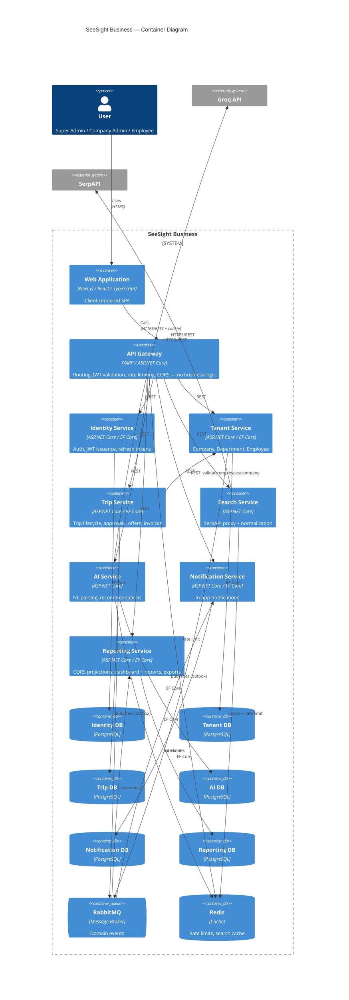
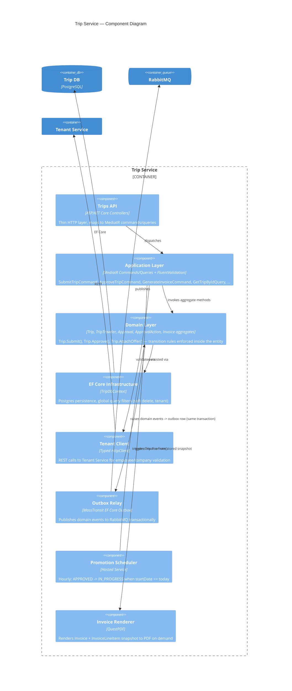
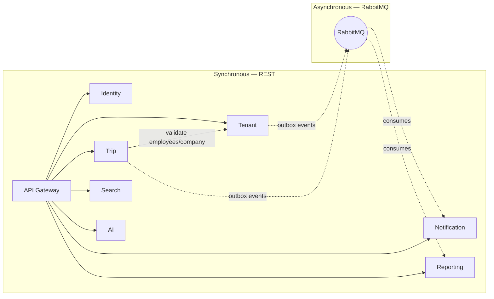
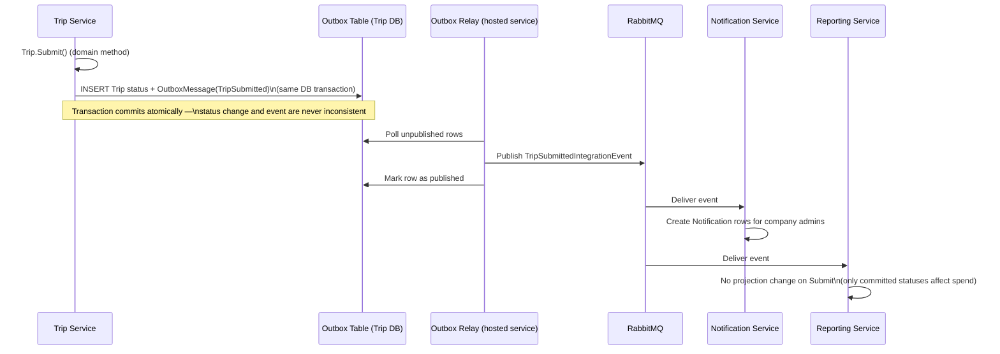
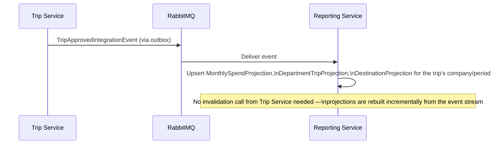
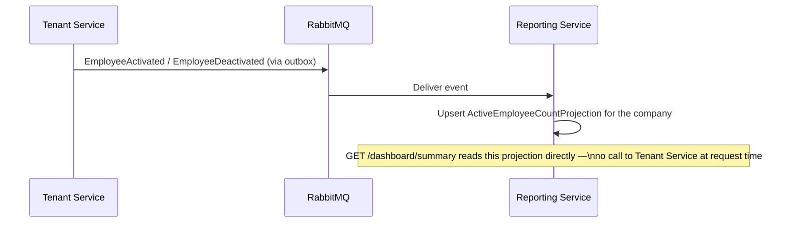
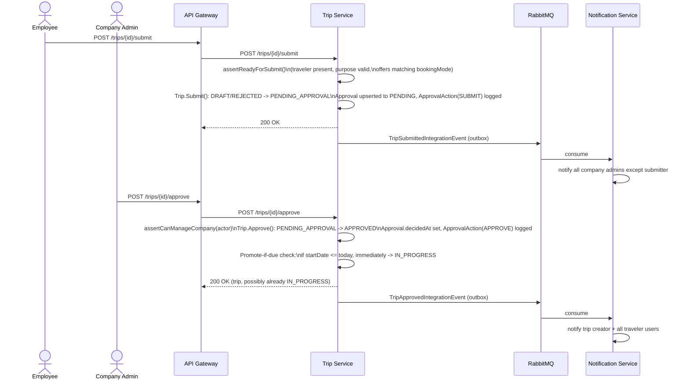

# Microservices

## 1. Service Catalog

Eight services + one gateway. Each service owns exactly one PostgreSQL database (schema in [DatabaseDesign.md](DatabaseDesign.md)). No service reads another service's database.

| Service | Owns | Responsibility | Architecture style | Ported from (original system) |
|---|---|---|---|---|
| **API Gateway** | nothing (stateless) | Routing, JWT auth/validation, rate limiting, CORS, correlation IDs, Swagger/OpenAPI *spec* aggregation (listing multiple services' docs in one UI). **No business logic, no business-data composition** — see [ADR 0001](adr/0001-no-gateway-aggregation-dashboard-in-reporting.md). | N/A (YARP + minimal middleware) | `main.ts` bootstrap concerns |
| **Identity Service** | `User`, `RefreshToken`, `PasswordResetToken` | Registration, login, logout, refresh rotation, password reset/change, JWT issuance (RS256), JWKS endpoint. | Clean Architecture | `modules/auth/**` |
| **Tenant Service** | `Company`, `Department`, `Employee` | Tenant lifecycle, department roster, employee roster + optional login provisioning. | Clean Architecture | `modules/companies|departments|employees/**` |
| **Trip Service** | `Trip`, `TripTraveler`, `Approval`, `ApprovalAction`, `FlightOfferSnapshot`, `HotelOfferSnapshot`, `Invoice`, `InvoiceLineItem` | The core aggregate: trip lifecycle state machine, approval workflow, offer-snapshot attach/select, auto-promotion scheduler, invoice generation. | Clean Architecture | `modules/trips|approvals/**` |
| **Search Service** | nothing (Redis cache only) | SerpAPI flight/hotel search + normalization. The only service permitted to call SerpAPI. | Vertical Slice | `modules/travel-search/**` |
| **AI Service** | `AiRecommendation` | NL travel-intent parsing, itinerary recommendation, ranking — from a shortlist always supplied inline by the caller. Never calls SerpAPI/Search Service, and never calls Trip Service — see [ADR 0002](adr/0002-ai-service-no-callback-to-trip-service.md). | Clean Architecture (light — no rich domain layer) | `modules/ai/**` |
| **Notification Service** | `Notification` | In-app notification storage, read/unread/clear. Reacts to RabbitMQ events. | Vertical Slice | `modules/notifications/**` |
| **Reporting Service** | denormalized projection tables | Dashboard **and** report aggregates (both are event-driven read models — see [ADR 0001](adr/0001-no-gateway-aggregation-dashboard-in-reporting.md)), CSV/JSON export. Pure CQRS read-side, built from RabbitMQ events. | CQRS read-side (no domain layer) | `modules/reports|dashboard/**` |

A standalone "File Storage Service" is explicitly **not** built — nothing in the current feature set persists uploaded binary files. Add it later, as its own service, only when a real file-upload feature needs it.

## 2. Communication

| Pattern | Used for | Rationale |
|---|---|---|
| **REST (HTTPS/JSON)** | All synchronous traffic: client ↔ Gateway, Gateway ↔ every service, and every service-to-service call needing an immediate answer. | One protocol for everything synchronous keeps the system simple to build, test, and trace. Matches the frontend's existing REST expectations. |
| **RabbitMQ (async, event-driven)** | Domain events the writer shouldn't block on: `TripSubmitted`, `TripApproved`, `TripRejected`, `TripCancelled`, `TripCompleted`, `OfferAttached`, `EmployeeCreated`, `EmployeeActivated`, `EmployeeDeactivated`, `EmployeeLoginProvisioned`, `CompanyDeactivated`, `DepartmentCreated`, `DepartmentUpdated` (the last two added per [ADR 0005](adr/0005-reporting-projection-idempotency-and-department-lookup.md), so Reporting Service's department-name lookup never goes stale). Every event carries a `Version`/`UpdatedAtUtc` field ([ADR 0005](adr/0005-reporting-projection-idempotency-and-department-lookup.md)) so consumers can detect and ignore out-of-order redelivery. Consumed by Notification Service and Reporting Service (Reporting Service now consumes both Trip **and** Tenant events, to build the Dashboard projection — see [ADR 0001](adr/0001-no-gateway-aggregation-dashboard-in-reporting.md)). | Notifications and report/dashboard projections don't need read-your-writes consistency with the triggering mutation — eventual consistency via events avoids a slow synchronous fan-out chain and decouples the writer from every reader's availability. |
| **gRPC** | **Not used by default anywhere in this system.** | No service has a demonstrated need for gRPC's binary protocol or streaming at this traffic scale; REST's debuggability and tooling outweigh the latency edge gRPC would offer. Introduce it later, deliberately, only against a measured hot path — never adopted wholesale up front. |

### Service-to-service synchronous calls (REST)

| Caller | Callee | Purpose |
|---|---|---|
| Trip Service | Tenant Service | Validate that traveler employee ids exist, belong to the company, and are active before creating `TripTraveler` rows; validate `companyId` on trip creation. |

**AI Service has no outbound service-to-service dependency at all — only Groq.** The Gateway routes `POST /ai/recommend-itinerary` straight through to AI Service; the frontend supplies the offer shortlist inline in the request body (it already has this data from the trip page it's rendering — see [APIContracts.md](APIContracts.md)). There is no "Trip Service calls AI Service" path in v1: nothing in the current feature set needs a server-initiated recommendation, so that edge isn't built speculatively — see [ADR 0002](adr/0002-ai-service-no-callback-to-trip-service.md). There is also no Gateway-level business-data aggregation of any kind — see [ADR 0001](adr/0001-no-gateway-aggregation-dashboard-in-reporting.md); the dashboard is a Reporting Service projection, not a fan-out call.

### Transactional Outbox (required for reliable event publishing)

Trip Service and Tenant Service write domain events to an outbox table **in the same EF Core transaction** as the state change they describe. Rather than hand-rolling the relay/publish/retry plumbing, this is implemented using **MassTransit's EF Core outbox integration** over the RabbitMQ transport — see [ADR 0003](adr/0003-adopt-masstransit-for-messaging.md). This closes the dual-write problem: a trip-status commit can never succeed while its corresponding event silently fails to publish, and a crash between "commit" and "publish" self-heals — the row is still there, unpublished, waiting for MassTransit's outbox delivery service to pick it up.

## 3. C4 Container Diagram

## 4. C4 Component Diagram — Trip Service

Trip Service is the richest domain in the system (the state machine, approvals, offers, and invoicing all live here), so it's the one zoomed in for a component-level view.

Note: AI Service does **not** appear in Trip Service's component diagram — Trip Service has no client for it (§2, and [ADR 0002](adr/0002-ai-service-no-callback-to-trip-service.md)). The frontend calls AI Service directly through the Gateway.

## 5. Microservice Interaction Diagram

Note the asymmetry: **Search Service and AI Service make no outbound service-to-service call at all** (only to their respective external provider) **and have no synchronous dependents besides the Gateway** — the only service-to-service REST edge in the entire system is Trip Service → Tenant Service. **Notification Service and Reporting Service have no synchronous callers at all** — they exist purely as event consumers. This is a deliberately sparse dependency graph: one synchronous edge, everything else either Gateway-fan-out or event-driven — which is what makes every service besides Trip/Tenant safe to scale, redeploy, or briefly go offline without blocking any user-facing write.

## 6. RabbitMQ Event Flow

Reporting Service also consumes Tenant Service's employee lifecycle events to maintain the `ActiveEmployeeCount` projection the Dashboard needs, closing the loop from [ADR 0001](adr/0001-no-gateway-aggregation-dashboard-in-reporting.md) — no synchronous Trip-Service-to-Tenant-Service call happens on a dashboard read:

## 7. Trip Approval Flow

## 8. Clean Architecture per Service

Not a single template applied uniformly — matched to each service's actual complexity, per your explicit instruction to avoid unnecessary abstraction:

- **Trip Service, Tenant Service** — full **Clean Architecture**: `Domain` (rich entities with behavior — `Trip.Submit()`/`Trip.Approve()` enforce the transition graph *inside the aggregate*, not in a service method checking a static map), `Application` (MediatR commands/queries + FluentValidation + pipeline behaviors for validation and outbox-write-in-transaction), `Infrastructure` (EF Core, REST clients to other services, outbox relay), `Api` (thin controllers). Domain events raised by the aggregate are dispatched via MediatR `INotification` after `SaveChanges`, feeding the outbox relay.
- **AI Service** — lighter Clean Architecture: skip the `Domain` entity layer (there's no rich aggregate — `AiRecommendation` is a record, not a state machine), keep `Application`/`Infrastructure`/`Api`.
- **Notification Service, Search Service** — **Vertical Slice Architecture**: one folder per feature (`CreateNotification/`, `ListNotifications/`, `SearchFlights/`), each with its own request/handler/validator co-located. Full 4-layer Clean Architecture on a 4-endpoint service is exactly the kind of premature structure this project avoids.
- **Reporting Service** — pure CQRS read-side: event consumers that update projections + query handlers that read them. No `Domain` layer — there's no business logic to protect, only data shape.
- **Repository pattern**: not used as a blanket rule. EF Core's `DbContext` already is the repository/unit-of-work. The one justified exception is Reporting Service's dedicated per-projection read-repositories, since they're intentionally decoupled from any write model.
- **Dependency Injection**: the built-in ASP.NET Core container throughout — no third-party DI container.

Shared library boundaries (what's cross-cutting infrastructure vs. what must stay inside a service) are defined in [CodingStandards.md](CodingStandards.md) §Shared Libraries.
