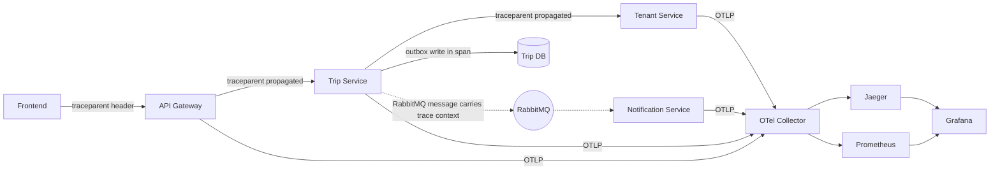

# Observability

## 1. Pillars

Every service ships with the same three pillars from day one (Phase 4 onward — see [DevelopmentRoadmap.md](DevelopmentRoadmap.md)), wired through `SeeSight.Shared.Observability`'s `AddSeeSightObservability()` extension so each service's `Program.cs` opts in with one line rather than reimplementing the setup:

| Pillar | Technology | Sink |
|---|---|---|
| Traces | OpenTelemetry (auto-instrumentation: ASP.NET Core, `HttpClient`, Npgsql, RabbitMQ client) | OTLP → Collector → Jaeger |
| Metrics | OpenTelemetry Metrics | OTLP → Collector → Prometheus |
| Logs | Serilog (structured JSON), enriched with the active OpenTelemetry trace/span id | Console (stdout, captured by the container runtime) + OTLP → Collector |

One correlation mechanism, not two: logs are correlated to traces via the trace/span id already present from OpenTelemetry, rather than inventing a second parallel correlation-id scheme. The Gateway additionally stamps a human-friendly `X-Request-Id` header purely for quick log-grep convenience, propagated downstream as a log-enrichment field (not a tracing mechanism).

## 2. Distributed Tracing Flow

A single trip-submission request is traceable end-to-end as one trace: Gateway → Trip Service → (Tenant Service validation call) → outbox write → RabbitMQ publish → Notification Service consume — every hop, sync or async, carries the same trace context.

## 3. Health Checks

Every service exposes:

- `GET /health/live` — process is up, no dependency checks (used for container restart decisions).
- `GET /health/ready` — dependency checks: database reachable (`DbContext.Database.CanConnectAsync()`), RabbitMQ reachable (for publishers/consumers), and any critical external dependency. **Redis is never part of readiness for any service** — rate limiting and the search cache both fail open on Redis unavailability ([ADR 0007](adr/0007-redis-dependent-features-fail-open.md)), so a service stays fully functional (just temporarily unprotected/uncached) without it; same reasoning for Search Service → SerpAPI (not part of readiness — briefly down shouldn't take the whole service out of rotation, that's what the cache + graceful-degradation behavior is for) and AI Service → Groq (rule-based fallback covers it). The full per-service breakdown of what's a hard vs. soft dependency is in [ServiceDependencyMatrix.md](ServiceDependencyMatrix.md).

Implemented via `Microsoft.Extensions.Diagnostics.HealthChecks`, registered per-service in `Program.cs`, with tags (`live`/`ready`) mapped to the two endpoints.

## 4. Structured Logging Conventions

- Serilog JSON output, one line per log event, minimum level `Information` in Production, `Debug` in Development.
- Standard enrichers on every service: `TraceId`, `SpanId`, `Service` (service name), `Environment`, `CorrelationId` (the Gateway's `X-Request-Id`, when present).
- **Never log**: passwords, password hashes, tokens, API keys, full JWTs, raw refresh tokens — the same discipline the original system's `sanitizePolicy()` enforced for AI prompts extends to logging: a shared `SeeSight.Shared.Observability` log-scrubbing enricher redacts any property whose name matches `password|token|secret|apikey` (case-insensitive) before it's written, as a defense-in-depth backstop against an accidental `logger.LogInformation("{@Request}", request)` capturing more than intended.

## 5. Metrics Worth Dashboarding From Day One

| Metric | Why |
|---|---|
| Request rate / latency (p50/p95/p99) / error rate per service (RED metrics) | Baseline health for every service. |
| Groq call latency + failure rate | Directly answers "how often is the rule-based fallback triggering" — a rising fallback rate is an AI-provider health signal worth alerting on. |
| SerpAPI call latency + failure rate | Same idea for Search Service. |
| RabbitMQ queue depth (per queue) | A growing Notification/Reporting queue means a consumer is falling behind or down — never a Trip/Tenant Service problem, since publishers never block on it. |
| Outbox unpublished-row age (oldest unpublished `OutboxMessage`) | Detects the relay itself being stuck — the one failure mode that wouldn't show up in RabbitMQ's own queue-depth metric. |
| EF Core query duration (via Npgsql instrumentation) | Surfaces N+1s or missing indexes early. |
| Redis connectivity failures (`rate_limiter_redis_unavailable_total`, cache-bypass count) | Both rate limiting and the search cache fail open on Redis unavailability ([ADR 0007](adr/0007-redis-dependent-features-fail-open.md)) — from a user's perspective the system keeps working normally during a Redis outage, so **this metric is the only signal** that the system is temporarily unprotected/uncached. Without an explicit alert on it, a Redis outage could go unnoticed for a long time. |

## 6. Grafana Dashboards (initial set)

1. **Service Overview** — RED metrics per service, one row per service.
2. **AI & Search Health** — Groq/SerpAPI latency, failure rate, fallback-trigger rate.
3. **Messaging Health** — RabbitMQ queue depth, outbox unpublished age, consumer lag.
4. **Business KPIs (from Reporting Service)** — trips submitted/approved/rejected per day, average approval turnaround time (derivable from `ApprovalAction` timestamps) — genuinely useful for the thesis write-up as evidence the system works end-to-end, not just that it's technically healthy.
5. **Redis Degradation** — the fail-open metric above, alerted on directly, since this is the one failure mode that's otherwise invisible from the outside (§ [ADR 0007](adr/0007-redis-dependent-features-fail-open.md)).

## 7. What's New vs. the Original System

The original system had a single `GET /health` endpoint and no tracing, metrics, or structured logging beyond NestJS's default console output. Everything in this document is net-new — there is no "port" here, only "build," since observability is one of the concrete goals of moving to microservices in the first place: a single process's stack trace is no longer sufficient to understand a request's full path.
