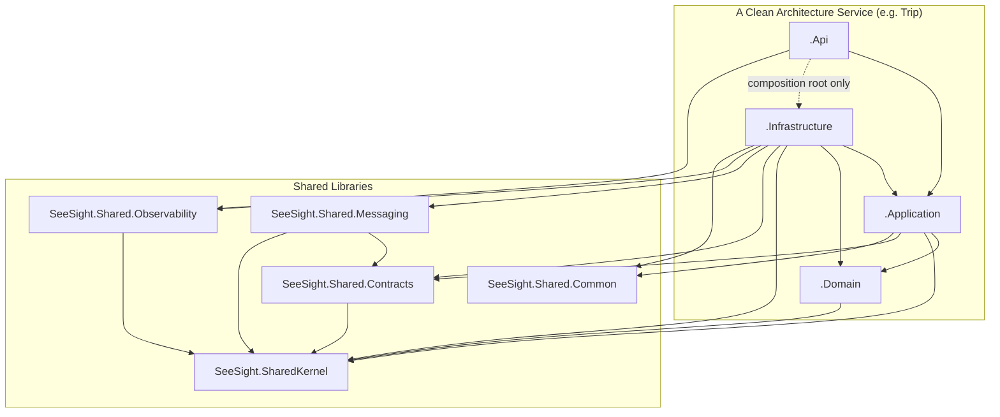
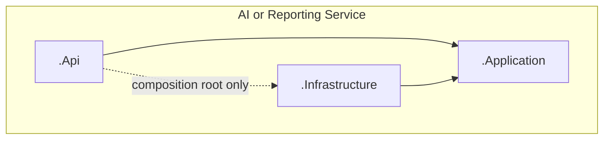
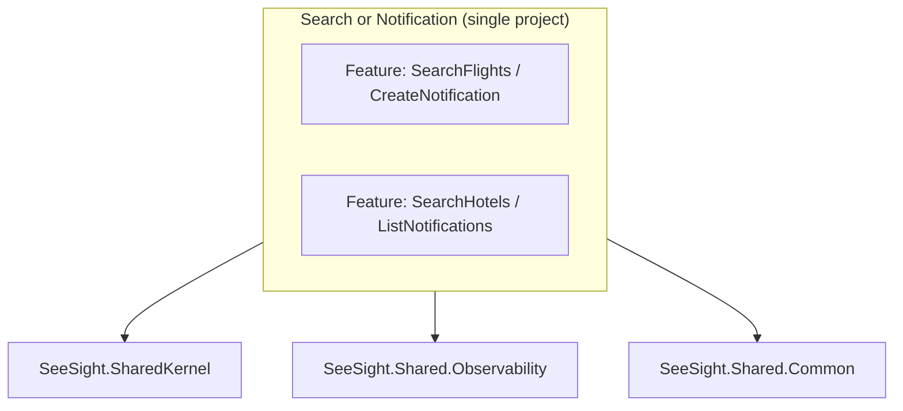
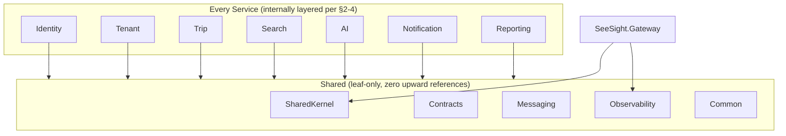

# Project Reference Diagram

Every project reference in the solution, why it's allowed, what's explicitly forbidden, and the argument for why no circular reference is possible anywhere in the graph. Companion to [SolutionStructure.md](SolutionStructure.md).

## 1. The One Rule That Prevents Every Circular Reference

**No service project ever references another service's project.** Cross-service communication happens exclusively over the network (REST, per [Microservices.md](Microservices.md) §2) or through RabbitMQ events (whose *contracts* live in the shared, service-agnostic `SeeSight.Shared.Contracts` — the events themselves, not the publishing/consuming service's code). This single rule is what makes the reference graph a strict DAG: services only ever reference *downward* into their own layers and *sideways* into `Shared.*`, never into each other, and `Shared.*` projects never reference *upward* into any service. There is no path through the reference graph that could loop back to its starting point.

This is enforced two ways: (1) structurally — a service project simply has no `ProjectReference` to another service's `.csproj` in the first place; (2) mechanically — each service's `ArchitectureTests` project asserts this with `NetArchTest` (a rule that fails the build if, say, `SeeSight.Trip.Infrastructure` ever gains a reference to any `SeeSight.Tenant.*` assembly).

## 2. Reference Diagram — Clean Architecture Services (Identity, Tenant, Trip)

Note the direction of every arrow: nothing in `Shared.*` points back up into `Domain`/`Application`/`Infrastructure`/`Api`, and `Domain` points at nothing but `SharedKernel`. `Api`'s reference to `Infrastructure` is annotated "composition root only" — it exists so `Program.cs` can call `services.AddInfrastructure(...)`, not because controllers call Infrastructure classes directly (they dispatch through `Application`'s MediatR handlers).

## 3. Reference Diagram — Light Clean Architecture (AI, Reporting — no Domain project)

Same shape, minus the `Domain` layer — there's no rich aggregate to isolate (`AiRecommendation` and the Reporting projections are records/read-models, not entities with behavior). `Application` here holds validation logic and query/command handlers directly.

## 4. Reference Diagram — Vertical Slice (Search, Notification)

Notification additionally references `SeeSight.Shared.Messaging` (it's a consumer) and `SeeSight.Shared.Contracts` (to deserialize the event DTOs it consumes). Search references neither — it publishes and consumes no events.

## 5. Full-System View — No Service References Another Service

There is deliberately **no arrow between any two boxes in the `Services` subgraph** — that absence is the entire point of this diagram. Every line crossing a service boundary in the *running system* (Trip→Tenant validation, the RabbitMQ events) is a network call or a message, never a `ProjectReference`. Compare against [ServiceDependencyMatrix.md](ServiceDependencyMatrix.md), which documents those *runtime* dependencies — this diagram documents that none of them are *compile-time* dependencies.

## 6. Per-Project Allowed / Forbidden / Reason

| Project category | Allowed to reference | Forbidden | Reason |
|---|---|---|---|
| `Gateway` | `SharedKernel`, `Shared.Observability` | Any service project; `Shared.Contracts`/`Shared.Messaging` (it neither publishes nor consumes events) | Keeps the "thin gateway" rule structurally true, not just documented — the Gateway project physically cannot import a service's business types. |
| `*.Domain` | `SharedKernel` only | `Application`, `Infrastructure`, `Api` (of its own or any other service); any NuGet package beyond the BCL (no EF Core attributes, no MassTransit types) | A Domain layer coupled to EF Core or HTTP can't be unit-tested without spinning up infrastructure — the entire reason this layer exists is to stay pure. |
| `*.Application` | Its own `Domain` (if present), `SharedKernel`, `Shared.Contracts`, `Shared.Common` | `Infrastructure` (of its own or any other service); any other service's `Domain`/`Application` | Application defines the *interfaces* Infrastructure implements (Dependency Inversion) — if it referenced Infrastructure directly, the dependency would point the wrong way. |
| `*.Infrastructure` | Its own `Application` + `Domain`, all `Shared.*`, third-party NuGet packages (EF Core, MassTransit, Refit/HttpClientFactory, Groq/SerpAPI SDKs, QuestPDF) | Any other service's `Domain`/`Application`/`Infrastructure`/`Api` project | Infrastructure is where typed `HttpClient`s to *other services* live — but as network clients calling a URL + shared DTO contract, never as a compiled reference to that service's internal code. |
| `*.Api` | Its own `Application`, its own `Infrastructure` (composition root only), `Shared.Observability` | Its own `Domain` directly (route through `Application`); any other service's project | Keeps controllers honest about only talking to their own service's Application layer — a controller reaching into Domain directly would bypass the validation/authorization pipeline Application provides. |
| `Shared.SharedKernel` | Nothing (BCL only) | Any service project, any other `Shared.*` project, any third-party package beyond what a value-object/interface library needs | The one library every project depends on must have zero dependencies of its own, or it becomes a hidden way for two unrelated services to end up coupled through a shared transitive reference. |
| `Shared.Contracts` | `SharedKernel` | Any service project; `Shared.Messaging`/`Shared.Observability`/`Shared.Common` (contracts shouldn't need messaging infrastructure or logging to just *be data*) | Event DTOs are pure data — giving this project other dependencies would make every consumer of an event pull in unrelated transitive packages. |
| `Shared.Messaging` | `Shared.Contracts`, `SharedKernel`, MassTransit packages | Any service project; `Shared.Observability`/`Shared.Common` (no need) | Messaging conventions only need to know event shapes (`Contracts`) and value objects (`SharedKernel`) — nothing else. |
| `Shared.Observability` | `SharedKernel`, OpenTelemetry/Serilog packages | Any service project; `Shared.Contracts`/`Shared.Messaging`/`Shared.Common` | Logging/tracing setup has no reason to know about event contracts or money-rounding logic. |
| `Shared.Common` | Nothing (BCL only) | Any service project, any other `Shared.*` project | Same reasoning as `SharedKernel` — a pure-utility leaf must stay a leaf. |
| `*.UnitTests` | Its service's `Domain`/`Application`, xUnit/FluentAssertions/NSubstitute | Its service's `Infrastructure`/`Api` (that's what makes it a *unit* test, not an integration test); any other service's project | Keeps the fast test suite fast — no DB, no HTTP, no container startup. |
| `*.IntegrationTests` | Its service's `Api` (transitively everything else in that service), Testcontainers, `WebApplicationFactory` | Any other service's project | Tests one service's full stack against real infrastructure, in isolation from every other service. |
| `*.ArchitectureTests` | All of its own service's projects, `NetArchTest` | Any other service's project | Needs to inspect its own service's assemblies to assert the layering rules in this table — has no business referencing another service. |

## 7. Verifying No Circular Reference Exists

A cycle would require some project `A` to depend (directly or transitively) on a project that depends back on `A`. Given the rules above:

- Every `Shared.*` project is either a pure leaf (`SharedKernel`, `Common`) or depends only on other `Shared.*` leaves (`Contracts`→`SharedKernel`; `Messaging`→`Contracts`+`SharedKernel`; `Observability`→`SharedKernel`) — **no `Shared.*` project depends on anything outside `Shared.*`**, so a cycle can never start or end inside the shared layer.
- Within one service, references only ever point from `Api`→`Application`→`Domain`, and `Infrastructure`→`Application`/`Domain` — a strict inward-pointing chain with `Domain` as the innermost leaf (referencing only `SharedKernel`). No project in this chain references `Api`, so the chain cannot loop back on itself.
- No service project references any other service's project, by the rule in §1 — so no cycle can form *across* services either.

Every edge in the full graph points either "inward" (toward `Domain`/`SharedKernel`) or "sideways into Shared" — never "outward toward Api" and never "across to another service." A graph where every edge strictly decreases some ordering (Api > Infrastructure > Application > Domain > SharedKernel) cannot contain a cycle, by construction. This invariant is what `NetArchTest` checks on every build, not just something asserted here once.
