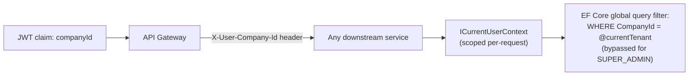
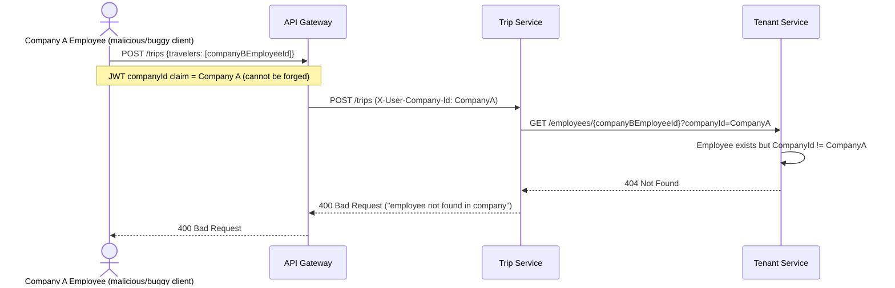

# Tenant Architecture

## 1. Model

SeeSight Business is multi-tenant with `Company` as the tenant root (owned by Tenant Service — see [DatabaseDesign.md](DatabaseDesign.md) §4). This document is the successor to the original system's `tenant.utils.ts` convention: same isolation guarantees, now enforced structurally rather than by a manually-called utility function.

- **Tenant identifier**: `CompanyId` (`Guid`), carried in the JWT's `companyId` claim (nullable — unassigned `COMPANY_ADMIN` self-signups and `SUPER_ADMIN` accounts have none).
- **Isolation strategy**: **database-per-service, not database-per-tenant.** All companies share each service's single database, tenant-scoped by a `CompanyId` column plus an EF Core global query filter — the same isolation model the original single-Postgres-many-companies system already used. A silo-per-tenant model (separate database per company) was considered and rejected: nothing in the current scale or compliance requirements justifies that operational cost, and it would be a much larger, unrequested change.

## 2. Tenant Context Propagation

The Gateway is the only place a `companyId` claim is read out of a JWT. Every service downstream receives it as a trusted header (§ [Authorization.md](Authorization.md) §2) and materializes it into a scoped `ICurrentUserContext` via the shared `CurrentUserContextMiddleware` (§ [CodingStandards.md](CodingStandards.md) §2 — pure header deserialization, no per-service reimplementation) that EF Core's global query filter reads on every query.

**Implementation note**: rather than hand-rolling the per-request tenant-context plumbing and query-filter wiring from scratch in every service, evaluate **Finbuckle.MultiTenant** at Phase 6 (Tenant Service) — it's a mature, purpose-built .NET library for exactly this problem (per-request tenant resolution + EF Core query filter integration) and may reduce custom code here further than what's described below. If adopted, it slots in underneath the same `ICurrentUserContext` contract and doesn't change any rule in this document — record the choice either way as an ADR (§ [CodingStandards.md](CodingStandards.md) §7).

## 3. Enforcement Points (Defense in Depth)

Three independent layers, each closing a different failure mode:

1. **JWT claim integrity** — RS256-signed, short-lived, validated once at the Gateway. A client cannot forge or extend its own `companyId` claim.
2. **EF Core global query filter** — every tenant-scoped entity (`Company`, `Department`, `Employee` in Tenant Service; `Trip` and its children in Trip Service) is automatically filtered to `CompanyId == currentTenant.CompanyId` unless the current user is `SUPER_ADMIN`. This is the direct successor to the original system's `assertCompanyAccess` — the difference is that forgetting to apply it is no longer possible for a standard query, because the filter is on the `DbContext` model itself, not something each new query author has to remember to add.
3. **Cross-service validation calls** — when Trip Service creates a `TripTraveler`, it calls Tenant Service (REST) to confirm the employee id really belongs to the `companyId` on the trip being created. Without this, a malicious or buggy caller could pass an employee id belonging to a *different* tenant, and — because there's no cross-service database foreign key (§ [DatabaseDesign.md](DatabaseDesign.md) §1) — nothing else would catch it. This call (and the Tenant→Identity login-provisioning call in §6 below) also carries the shared internal-service token from [ADR 0006](adr/0006-internal-service-to-service-authentication.md) — tenant isolation here depends on the caller's forwarded `companyId` claim being genuine, which in turn depends on these internal endpoints only being reachable by legitimate internal callers, not on network placement alone.

## 4. Super-Admin Cross-Tenant Access

Preserved exactly from the original system's two-function split:

- **Read/write a specific resource across tenants** (`assertCompanyAccess`'s super-admin bypass): the EF Core query filter includes an `OR currentTenant.IsSuperAdmin` clause, so a super admin's queries see every company's data through the same code path as a tenant-scoped user — no special-cased query anywhere.
- **List/create operations that need an explicit target tenant** (`resolveTenantCompanyId`'s rule): a super admin calling a list/create endpoint **must** pass an explicit `companyId` — there is no "default tenant" to silently fall back to. A non-super-admin either uses their own `companyId` implicitly or gets a `403` if they pass a different one. This rule is implemented as a small `ITenantResolver.Resolve(ICurrentUserContext, Guid? requestedCompanyId)` helper inside each service's Application layer (not EF Core-filter-based, since it applies before a query even runs) — one of the few pieces of tenant logic that's genuinely about *request validation* rather than *query scoping*, so it lives in the Application layer, not buried in infrastructure.

## 5. Cross-Tenant Attack Prevented — Illustration

Without step 3 (the cross-service validation call), Trip Service would have no way to know `companyBEmployeeId` doesn't belong to Company A — this is precisely the gap that database-level foreign keys closed for free in the original monolith, and that database-per-service must close explicitly instead.

## 6. Cross-Service Write Consistency: Employee Login Provisioning

`POST /employees` with `createLogin: true` writes to **two** services in one logical operation: Tenant Service creates the `Employee` row, and Identity Service creates the linked `User` (and generates the one-time temp password the API response must return immediately — this is a synchronous, not eventually-consistent, requirement, since the admin needs the password in the response body right now). This two-service write is a real distributed-consistency risk that the original monolith never had to think about (it was one local transaction there) and that the first architecture-review pass left implicit. It's addressed explicitly here rather than assumed away:

1. Tenant Service calls Identity Service (REST) to create the `User` first, receiving back `UserId` + the temp password.
2. Tenant Service then saves its own `Employee` row locally, referencing that `UserId`.
3. **If step 2 fails** (validation error, DB issue, etc.) **after step 1 already succeeded**, Tenant Service calls Identity Service again with a compensating action — delete/deactivate the just-created `User` — before returning the error to the client. This prevents an orphaned Identity Service account with no corresponding Employee record.

This synchronous-call-plus-compensation approach is chosen over a fully event-driven "publish `EmployeeLoginRequested`, react asynchronously" flow specifically because the API contract requires returning the temp password in the immediate HTTP response (§ [APIContracts.md](APIContracts.md)) — an async flow would need the client to poll for the password afterward, which changes the contract and the frontend's flow for no benefit here. The synchronous approach preserves the existing contract; the compensating action is what makes it safe.

## 7. What Changed vs. the Original System

| Original | New |
|---|---|
| `assertCompanyAccess`/`resolveTenantCompanyId` — plain functions every service must remember to call | `ICurrentUserContext` + EF Core global query filter — automatic for standard queries, explicit helper only for the request-validation cases that genuinely need it |
| Cross-tenant referential integrity given for free by a single shared Postgres database's foreign keys | Explicit synchronous validation calls between services at write time (§3) |
| Same super-admin bypass and "companyId required for super admins on list/create" rules | Preserved exactly — no behavioral change, only *where* the rule lives |
